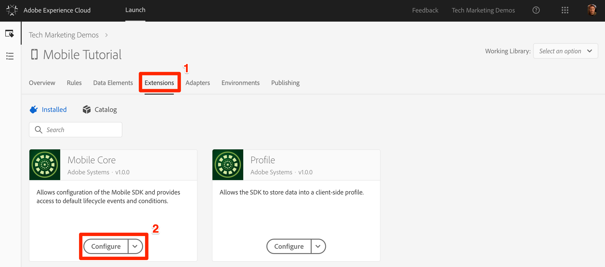
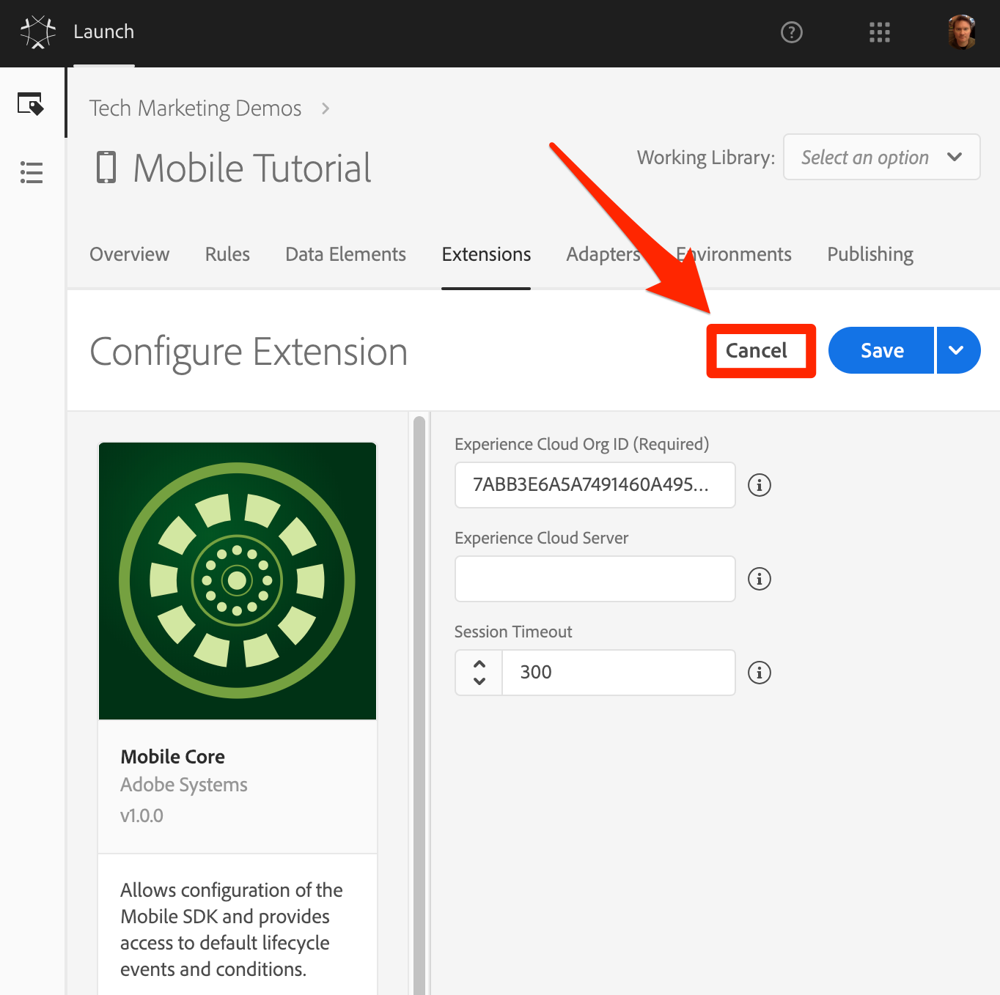
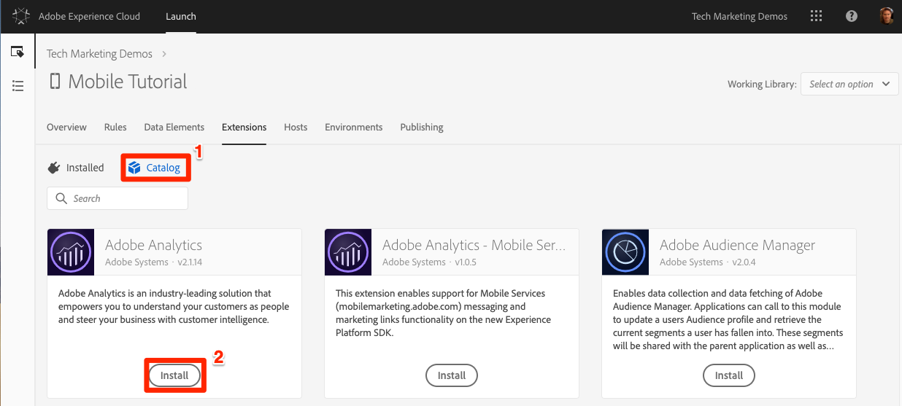
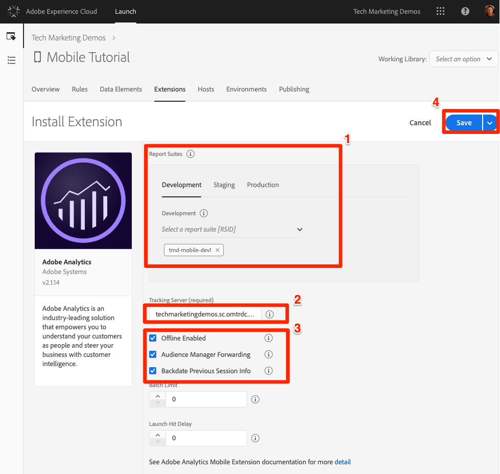
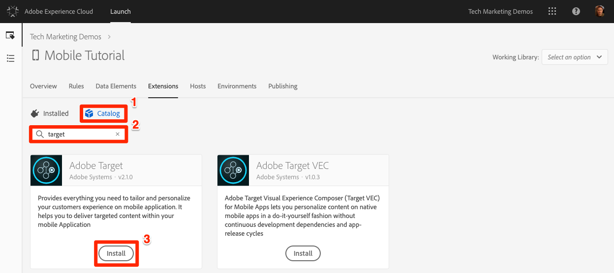
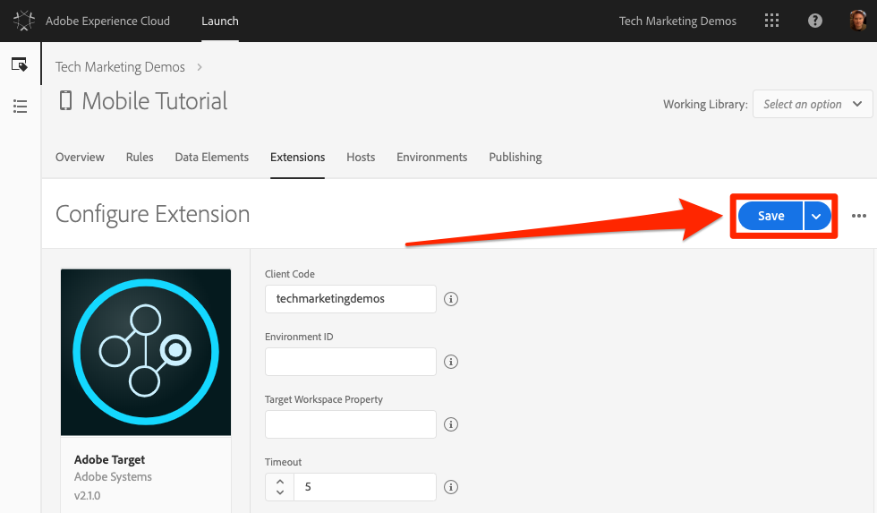

# Add Extensions

In this lesson, you will add extensions to your Launch property.

Launch is a platform that allows Adobe and third-party vendors to create extensions to make it easy to deploy their solutions through Launch. An extension is a package of code that extends the Launch interface and client functionality. Extensions give you the ability to choose only the parts of the Adobe Experience Platform Mobile SDK that you need for your specific app.  You can think of Launch as an operating system, and extensions are the apps you use to achieve your tasks.

Since you will be implementing the Adobe solutions (e.g. Target, Analytics, and Audience Manager), you will add the necessary extensions required to support them.

>[!WARNING]
>
>Adding and removing Extensions in mobile Launch properties requires you to update your app. This is different from web Launch properties, in which you can add or remove extensions at any time, without having to update your website.

## Prerequisites

Your Launch user account needs permission to "Manage Extensions" in order to complete this lesson. If you are unable to complete any of these steps because the user interface options are not available to you, reach out to your Experience Cloud Administrator for access. For more information on Launch permissions, see [the documentation](https://docs.adobe.com/content/help/en/launch/using/reference/admin/user-permissions.html).

You will need the following solution details:

* At least one Analytics report suite ID. The report suite should have [App Reports  enabled](https://docs.adobe.com/content/help/en/analytics/admin/admin-tools/mobile-management.html). If you don't have a test/dev report suite that you can use for this tutorial, please [create one](https://docs.adobe.com/content/help/en/analytics/admin/manage-report-suites/new-report-suite/new-report-suite.html). One report suite is sufficient for this tutorial, but in the real world you would want to use different report suites for your Development, Staging, and Production environments.

* Your Analytics tracking server. You can retrieve your tracking server from your current implementation, Adobe Consultant or Customer Care representative.

## Learning Objectives

At the end of this lesson, you will be able to:

* Add Extensions to a mobile Launch property
* Configure the Analytics extension
* Configure the Target extension

>[!NOTE]
>
>Adobe Audience Manager can be implemented via a configuration in the Analytics extension and thus you will not need to add the Audience Manager extension in this tutorial

## Review the Pre-installed extensions

1. Click the **[!UICONTROL Extensions]** tab to go to the extensions page
1. Note that the Mobile Core and `Profile` extensions are pre-installed in your new mobile property
1. Click the **[!UICONTROL Configure]** button on the Core extension to examine its settings

   

1. The Mobile Core extension represents the core Adobe Experience Platform Mobile SDK required for any app implementation. The core contains common set of functionality and frameworks such as a Experience Cloud Identity services, data event hub, rules engine, reusable networking, disk access routines, etc., which is required by all Adobe and third-party extensions.  For more information on the Mobile Core extension, see [the documentation](https://aep-sdks.gitbook.io/docs/using-mobile-extensions/mobile-core).

   1. Note that your Experience Cloud Org ID is detected automatically and pre-populated
   1. The Experience Cloud Server field allows you to specify a custom endpoint for Visitor ID Service requests. Use the default setting (leave it blank) for this tutorial.
   1. The Session Timeout field allows you to specify when an app Lifecycle session should timeout. By default, it will timeout if the app is in the background for 300 seconds. Use the default setting for this tutorial.

1. Since you haven't changed any of the settings, click **[!UICONTROL Cancel]** to leave the extension configuration

    

1. The Profile extension allows the SDK to store data in a client-side profile. It has no configurations, so there is nothing to look at. For more information on the Profile extension, see [the documentation](https://aep-sdks.gitbook.io/docs/using-mobile-extensions/profile).

## Add the Solution Extensions

Now it's time to get to the fun part and start adding the extensions for the solutions you will be implementing in this tutorial. When using Launch with mobile applications, the app must be updated every time an extension is added or removed. In order to save time later, we will add all of the extensions in this lesson. Just skip any solutions which your company has not licensed.

### Add the Adobe Analytics extension

>[!NOTE]
>
>If you do not have a license for Adobe Analytics, you can skip this section. At this time, the Analytics extension for mobile properties is used solely to manage SDK settings and does not add interface options to Launch, such as Rule actions.

**To add the extension**

1. Click on the Catalog tab to see the _uninstalled_ extensions

1. Find the **[!UICONTROL Adobe Analytics]** extension and click **[!UICONTROL Install]**
  
    

1. Select your **[!UICONTROL Report Suites]** from the pre-populated lists. These are the Report Suites to which the app will send data. You can select different report suites for your Development, Staging, and Production Environments.
1. Your **[!UICONTROL Analytics Tracking Server]** may be pre-populated or you may need to select it from a pre-populated list or enter it manually. This is the domain to which the beacons will be sent, typically in the format `yoursite.sc.omtrdc.net`.
1. Check the box for **[!UICONTROL Offline Enabled]**. When the Offline Enabled check box is selected, Analytics hits are queued when your device is offline and are sent later when your device is back online. To use offline tracking, **ensure** that your report suite is timestamp enabled. For more information, see the [documentation](https://docs.adobe.com/content/help/en/analytics/implementation/javascript-implementation/offline-tracking.html).
1. Check the box for **[!UICONTROL Audience Manager Forwarding]**. This will forward Analytics data to Audience Manager, so you won't have to make an additional call from the app to Audience Manager. In this exercise we will assume that you have Audience Manager, and are therefore forwarding the data from Analytics. If you do not have Audience Manager, do not check this box as you set up Analytics for your own implementation.
1. Check the box to **[!UICONTROL Backdate Previous Session Info]**
1. Click the **[!UICONTROL Save]** button
  
    

### Add the Target extension

The Adobe Target extension supports all of the API familiar to users of our earlier mobile SDKs to deliver personalized content into your app.

>[!NOTE]
>
>If you do not have a license for Adobe Target, you can skip this section. At this time, the Target extension for mobile properties is used solely to manage SDK settings and do not add interface options to Launch, such as Rule actions.

**To add the extension**

1. Click on the Catalog tab to see the _uninstalled_ extensions

1. Find the **[!UICONTROL Adobe Target]** extension and click **[!UICONTROL Install]**
  
   

1. Your **[!UICONTROL Client Code]** will pre-populate.
1. Leave the **[!UICONTROL Environment Id]** blank. This setting is used in conjunction with the [Hosts](https://docs.adobe.com/help/en/target/using/administer/hosts.html) feature in Adobe Target, which allows you to send the data to different reporting environments (e.g. Dev, Staging, Production). By default, the data will be sent to the Production environment.
1. Leave the **[!UICONTROL Target Workspace Property]** blank. This setting is used in conjunction with the Target Premium [Enterprise User Permissions](https://docs.adobe.com/content/help/en/target/using/administer/manage-users/enterprise/property-channel.html) feature.
1. Leave the **[!UICONTROL Timeout]** set to 5 seconds. This setting controls how long the app should wait for the Target response before displaying default content.
1. Click the **[!UICONTROL Save]** button
  
    

That's it! Now that you have added the extensions to your property, you can add them to a library:

[Next "Create a Library" >](launch-create-a-library.md)
